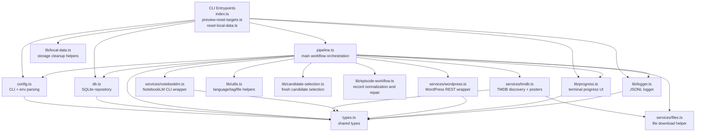
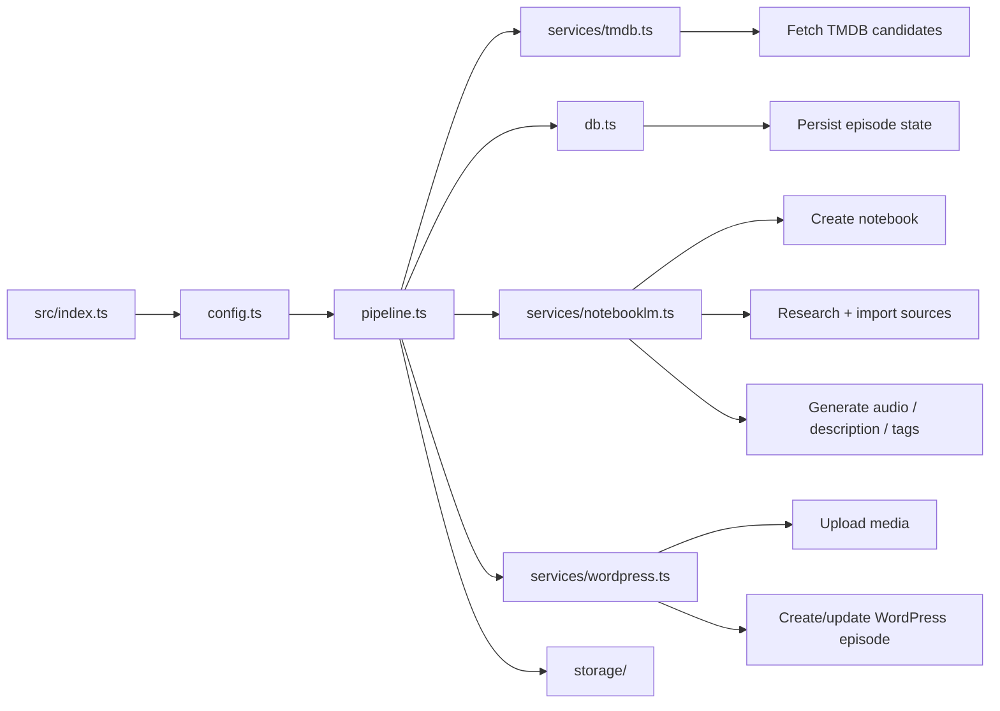

# Architecture

## Directory Tree

```text
podcast.sh/
├── src/
│   ├── index.ts
│   ├── preview-reset-targets.ts
│   ├── reset-local-data.ts
│   ├── pipeline.ts
│   ├── config.ts
│   ├── db.ts
│   ├── types.ts
│   ├── services/
│   │   ├── tmdb.ts
│   │   ├── notebooklm.ts
│   │   ├── wordpress.ts
│   │   └── files.ts
│   └── lib/
│       ├── progress.ts
│       ├── logger.ts
│       ├── utils.ts
│       ├── candidate-selection.ts
│       ├── episode-workflow.ts
│       └── local-data.ts
├── tests/
│   ├── candidate-selection.test.ts
│   ├── config.test.ts
│   ├── db.test.ts
│   ├── episode-workflow.test.ts
│   ├── local-data.test.ts
│   └── utils.test.ts
├── dist/
│   └── compiled JavaScript output
├── storage/
│   ├── db/
│   ├── posters/
│   ├── audio/
│   └── logs/
├── README.md
├── AGENTS.md
├── PROJECT_REQUIREMENTS.md
├── LANGUAGES.md
├── REGIONS.md
├── .env.example
├── package.json
└── tsconfig.json
```

## Module Relationship Diagram



## Runtime Flow



## File Responsibilities

- `src/index.ts`
  Main command entry. Loads env, parses CLI args, creates logger/progress, and runs the pipeline.

- `src/pipeline.ts`
  The core workflow coordinator. This is the main place to inspect when behavior changes affect resource selection, NotebookLM, or WordPress publishing.

- `src/config.ts`
  Central source of truth for CLI rules and environment validation.

- `src/db.ts`
  Manages the SQLite schema and all episode persistence operations.

- `src/services/tmdb.ts`
  Handles TMDB discovery requests, region filtering, and poster retrieval.

- `src/services/notebooklm.ts`
  Wraps `nlm` commands for notebooks, research, source import, audio generation, and downloads.

- `src/services/wordpress.ts`
  Handles REST auth checks, media upload, taxonomy creation, post publishing, and cleanup.

- `src/lib/utils.ts`
  Shared utility layer for language normalization, prompt mapping, tag parsing, file naming, and title generation.

- `src/lib/candidate-selection.ts`
  Expands TMDB fetch windows until enough unseen candidates are found.

- `src/lib/episode-workflow.ts`
  Repairs and normalizes locally stored episode data before publish/retry.

- `src/lib/progress.ts`
  Reusable progress bar and spinner renderer for interactive commands.

- `src/lib/logger.ts`
  Writes structured run logs to `${STORAGE_DIR}/logs`.

- `src/lib/local-data.ts`
  Local storage path builder and folder reset helper for maintenance commands.

## Test Coverage Map

- `tests/config.test.ts`
  CLI/env parsing and default/fallback behavior
- `tests/db.test.ts`
  SQLite uniqueness and backlog ordering
- `tests/utils.test.ts`
  language mapping, notebook text extraction, tag parsing
- `tests/candidate-selection.test.ts`
  fresh candidate selection logic
- `tests/episode-workflow.test.ts`
  episode normalization and repair decisions
- `tests/local-data.test.ts`
  local storage cleanup behavior
